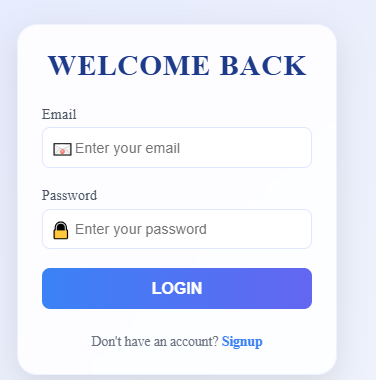
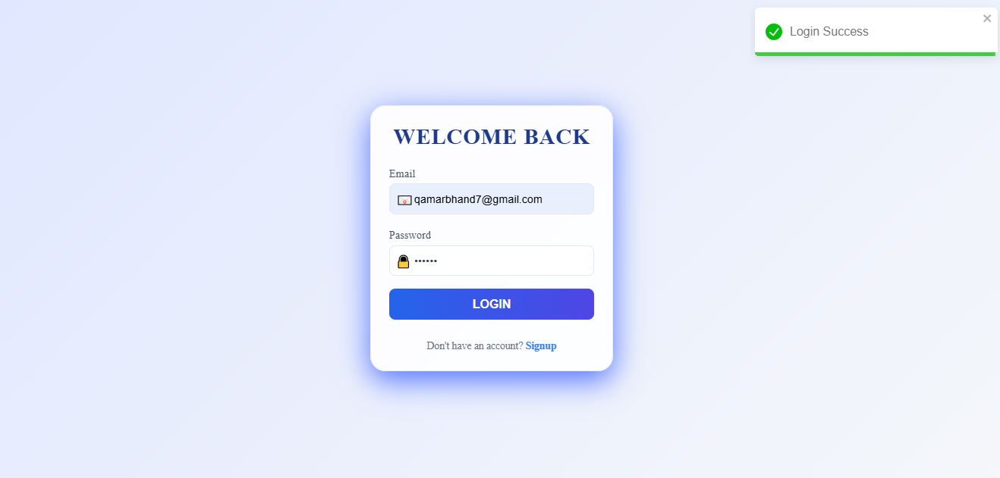
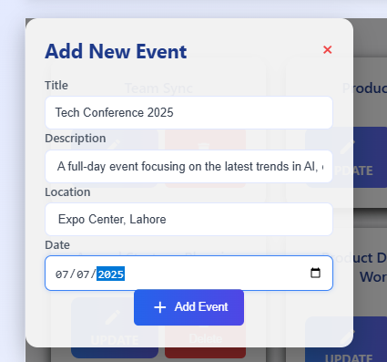
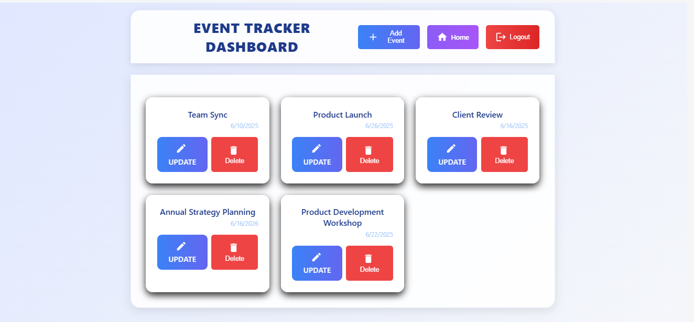
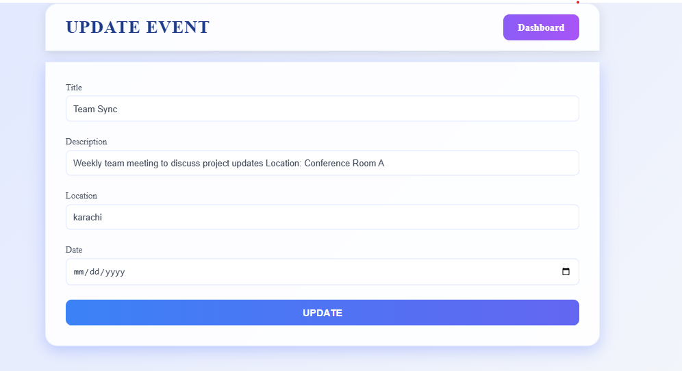

# 📅 Event Tracker - Full Stack App

A fully functional **MERN stack application** (MongoDB, Express, React, Node.js) for managing personal or organizational events. This app includes secure user authentication and full CRUD operations on events with a modern frontend and robust backend.

---

## 🚀 Features

- 🔐 User Signup & Login (JWT Authentication)
- 🧾 Create, View, Update, and Delete Events
- ✅ Input Validation using Joi
- 🔒 Protected Routes using JWT
- 🌐 RESTful API with Express
- 🧠 Password hashing using bcrypt
- 🎨 Frontend built with React

---

## 🧱 Tech Stack

**Frontend:**  
- React.js  
- Axios  
- React Router  
- Pure CSS / Tailwind (optional)

**Backend:**  
- Node.js  
- Express.js  
- MongoDB (with Mongoose)  
- JWT for authentication  
- bcrypt for password hashing  
- Joi for data validation  
- dotenv for environment variables


## 🔧 Installation & Setup

### 1️⃣ Clone the Repository

```bash
[git clone https://github.com/yourusername/event-tracker.git](https://github.com/Suhail-Ahmed7/Event-Tracker)
cd event-tracker

2️⃣ Setup Backend
cd backend
npm install

3️⃣ Setup Frontend
cd ../frontend/UI
npm install
npm start


## 📸 Screenshots

### 🏠 Home Page  


### 🔐 Login Page  


### 🔐 Login Page (Alternate)  


### 🧾 Signup Page  
!([Signp page.png](https://github.com/Suhail-Ahmed7/Event-Tracker/blob/main/Signp%20page.png))

### 🆕 Add New Event  


### 📋 Dashboard  


### 🔁 Update Event  

